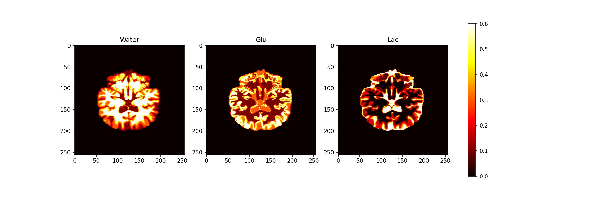

## three chemical components plot

This water glu lac combination is from fsl fast tool, and the plot code is available for mrspy >= 0.2.2

```bash
# demo plot code use .nii.gz file to plot
python3 water_glu_lac_plot.py
```

