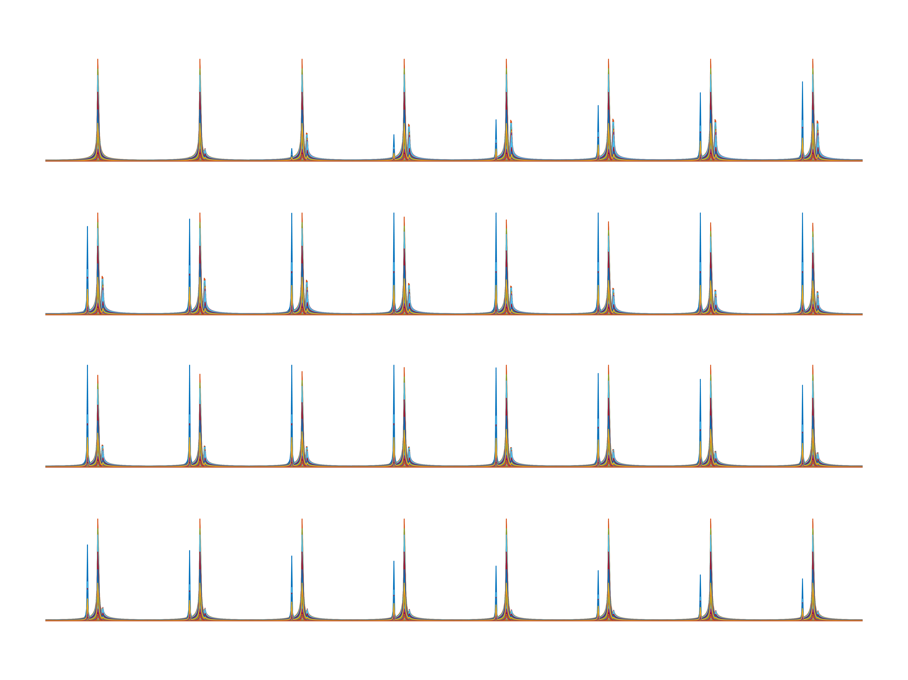

## A python library use torch intended to make the MRS simulation faster

Basic usage of GPU

```python
from mrspy.util import load_mrs_mat
from mrspy.sim import Simulation
import os
from scipy.io import savemat
import numpy as np
import time

demo_folder = "/home/data1/data/dmi_si_hum/data_metimg/row0_IXI255-HH-1882-T1"

water_img = os.path.join(demo_folder, "WaterImag.mat")
water_img = load_mrs_mat(water_img, output_type="tensor")
water_img = water_img.double()

glu_img = os.path.join(demo_folder, "GluImag.mat")
glu_img = load_mrs_mat(glu_img, output_type="tensor")
glu_img = glu_img.double()

lac_img = os.path.join(demo_folder, "LacImag.mat")
lac_img = load_mrs_mat(lac_img, output_type="tensor")
lac_img = lac_img.double()

cfg = {
    "curve": "default",
    "device": "cuda:0",
    "return_type": {
        "gt",
        "no",
        "wei",
        "wei_no"},
    "wei_no": {
        "noise_level": 0.02
    },
    "no": {
        "noise_level": 0.02
    },
    "wei": {
        "average": 263
    },
    "return_dict" : True
}

start_time = time.time()
target_size = 32
sim = Simulation(target_size=target_size, cfg=cfg)

# we will have res["gt"], res["no"], res["wei"], res["wei_no], each of shape 32, 120, 32, 32
res = sim.simulation(water_img=water_img, glu_img=glu_img, lac_img=lac_img)
end_time = time.time()
print(f"Total time taken by GPU: {end_time - start_time:.2f} seconds")

saved_dir = "/home/data1/musong/workspace/2025/1/1-22/log/mat_data"
os.makedirs(saved_dir, exist_ok=True)

for key, value in res.items():
    value = np.array(value.detach().cpu())
    value_float16 = value.astype(np.float16)
    savemat(f"{saved_dir}/{key}.mat", {key: value_float16})
```

Basic usage of CPU

```python
from mrspy.util import load_mrs_mat
from mrspy.sim import Simulation
import os
from scipy.io import savemat
import numpy as np
import time

demo_folder = "/home/data1/data/dmi_si_hum/data_metimg/row0_IXI255-HH-1882-T1"

water_img = os.path.join(demo_folder, "WaterImag.mat")
water_img = load_mrs_mat(water_img, output_type="tensor")
water_img = water_img.double()

glu_img = os.path.join(demo_folder, "GluImag.mat")
glu_img = load_mrs_mat(glu_img, output_type="tensor")
glu_img = glu_img.double()

lac_img = os.path.join(demo_folder, "LacImag.mat")
lac_img = load_mrs_mat(lac_img, output_type="tensor")
lac_img = lac_img.double()

cfg = {
    "curve": "default",
    "device": "cpu",
    "return_type": {
        "gt",
        "no",
        "wei",
        "wei_no"},
    "wei_no": {
        "noise_level": 0.02
    },
    "no": {
        "noise_level": 0.02
    },
    "wei": {
        "average": 263
    },
    "return_dict" : True
}

start_time = time.time()
target_size = 32
sim = Simulation(target_size=target_size, cfg=cfg)

# we will have res["gt"], res["no"], res["wei"], res["wei_no], each of shape 32, 120, 32, 32
res = sim.simulation(water_img=water_img, glu_img=glu_img, lac_img=lac_img)
end_time = time.time()
print(f"Total time taken by CPU: {end_time - start_time:.2f} seconds")

saved_dir = "/home/data1/musong/workspace/2025/1/1-22/log/mat_data"
os.makedirs(saved_dir, exist_ok=True)

for key, value in res.items():
    value = np.array(value.detach().cpu())
    value_float16 = value.astype(np.float16)
    savemat(f"{saved_dir}/{key}.mat", {key: value_float16})
```

## batch processing with GPU

```python
from mrspy.util import load_mrs_mat
from mrspy.sim import BatchSimulation
import os
from scipy.io import savemat
import numpy as np
import time

demo_folder = "/home/data1/data/dmi_si_hum/data_metimg/row0_IXI255-HH-1882-T1"

water_img = os.path.join(demo_folder, "WaterImag.mat")
water_img = load_mrs_mat(water_img, output_type="tensor")
water_img = water_img.double()

glu_img = os.path.join(demo_folder, "GluImag.mat")
glu_img = load_mrs_mat(glu_img, output_type="tensor")
glu_img = glu_img.double()

lac_img = os.path.join(demo_folder, "LacImag.mat")
lac_img = load_mrs_mat(lac_img, output_type="tensor")
lac_img = lac_img.double()

batch_size = 4

water_img = water_img.unsqueeze(0).repeat(batch_size, 1, 1)
glu_img = glu_img.unsqueeze(0).repeat(batch_size, 1, 1)
lac_img = lac_img.unsqueeze(0).repeat(batch_size, 1, 1)

cfg = {
    "curve": "default",
    "device": "cuda:0",
    "return_type": {
        "gt",
        "no",
        "wei",
        "wei_no"},
    "wei_no": {
        "noise_level": 0.02
    },
    "no": {
        "noise_level": 0.02
    },
    "wei": {
        "average": 263
    },
    "return_dict" : True
}

start_time = time.time()
target_size = 32
sim = BatchSimulation(target_size=target_size, cfg=cfg)

res = sim.simulation(water_img=water_img, glu_img=glu_img, lac_img=lac_img)
end_time = time.time()
print(f"Total time taken by GPU: {end_time - start_time:.2f} seconds")

saved_dir = "/home/data1/musong/workspace/2025/2/2-14/mat_data"
os.makedirs(saved_dir, exist_ok=True)

for key, value in res.items():
    value = np.array(value.detach().cpu())
    single_batch = value[0, ...]
    value_float16 = single_batch.astype(np.float16)
    # savemat(f"{saved_dir}/{key}_single_batch.mat", {key: value_float16})
```

## datapipeline usage

This script generates simulated water, glucose, and lactate images from CSF, GM, and WM tissue maps, using a custom weight dictionary. It processes and resizes the images, then saves them as PNG files.

```python
from mrspy.util.fast.datapipeline import datapipeline 
from mrspy.plot import plot

CSF_file_path = "/home/data1/musong/data/IXI/T1/fast/IXI216-HH-1635-T1/IXI216-HH-1635-T1_pve_0.nii.gz"
GM_file_path = "/home/data1/musong/data/IXI/T1/fast/IXI216-HH-1635-T1/IXI216-HH-1635-T1_pve_1.nii.gz"
WM_file_path = "/home/data1/musong/data/IXI/T1/fast/IXI216-HH-1635-T1/IXI216-HH-1635-T1_pve_2.nii.gz"

weight_dict={
    "CSF": [0.1, 0.3, 0.6],
    "GM": [0.3, 0.6, 0.2],
    "WM": [0.6, 0.1, 0],
}

size=(128, 128)
pipeline = datapipeline(CSF_file_path=CSF_file_path, 
                        GM_file_path=GM_file_path, 
                        WM_file_path=WM_file_path, 
                        weight_dict=weight_dict, 
                        size=size, 
                        pad=0.3, 
                        pad_axis="x")

pipeline.process()
water = pipeline.water
print(water.shape)
pipeline.plot(idx=157, cmap="hot")

pipeline.save(output_path="/home/data1/musong/workspace/2025/2/2-13/temp", output_type="png")
```

## install

```bash
pip install git+https://github.com/txz32102/MRSpy.git@0.3.2
```

Visualization results for `simulated.mat` can be viewed using MATLAB, available in the `demo` folder.



