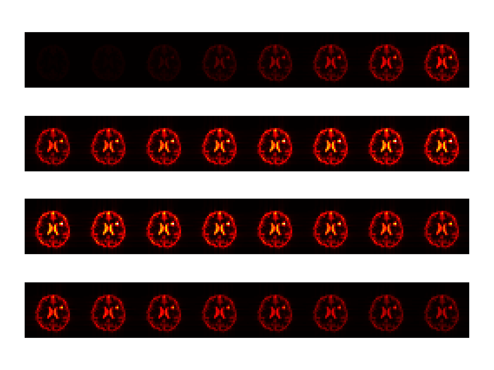

## A python library use torch intended to make the MRS simulation faster

Basic usage

```python
import torch
from mrspy.util import load_mrs_mat
from mrspy.sim import Simulation
from mrspy.util import fft_kspace_to_xspace
import os
from scipy.io import savemat

# Define the directory paths
demo_folder = "/home/data1/data/dmi_si_hum/data_metimg/row0_IXI255-HH-1882-T1"
log_dir = "/home/data1/musong/workspace/2025/1/1-22/log"
os.makedirs(log_dir, exist_ok=True)  # Create log directory if it doesn't exist

# Load water image data (256x256 tensor)
water_img_path = os.path.join(demo_folder, "WaterImag.mat")
water_img = load_mrs_mat(water_img_path, output_type="tensor")

# Load glutamate image data (256x256 tensor)
glu_img_path = os.path.join(demo_folder, "GluImag.mat")
glu_img = load_mrs_mat(glu_img_path, output_type="tensor")

# Load lactate image data (256x256 tensor)
lac_img_path = os.path.join(demo_folder, "LacImag.mat")
lac_img = load_mrs_mat(lac_img_path, output_type="tensor")

target_size = 32
# Perform the simulation
sim = Simulation(target_size=target_size)  # Initialize the simulation object
final_kspace = sim.simulation(water_img=water_img, glu_img=glu_img, lac_img=lac_img)

# Convert k-space data back to image space
# Apply Fourier transform along the second dimension (frequency -> spatial domain)
k_field_spec = torch.fft.fftshift(torch.fft.fft(final_kspace, dim=1), dim=1)

# Convert k-space data to spatial image space across the second and third dimensions
spec_imag = fft_kspace_to_xspace(fft_kspace_to_xspace(k_field_spec, 2), 3)

# Normalize the output image to the range [0, 1]
ground_truth = torch.abs(spec_imag) / torch.max(torch.abs(spec_imag))

# Save the simulated data to a .mat file
savemat(f"{log_dir}/simulated.mat", {"gt": ground_truth.numpy()})
```

Visualization results for `simulated.mat` can be viewed using MATLAB, available in the `demo` folder.





